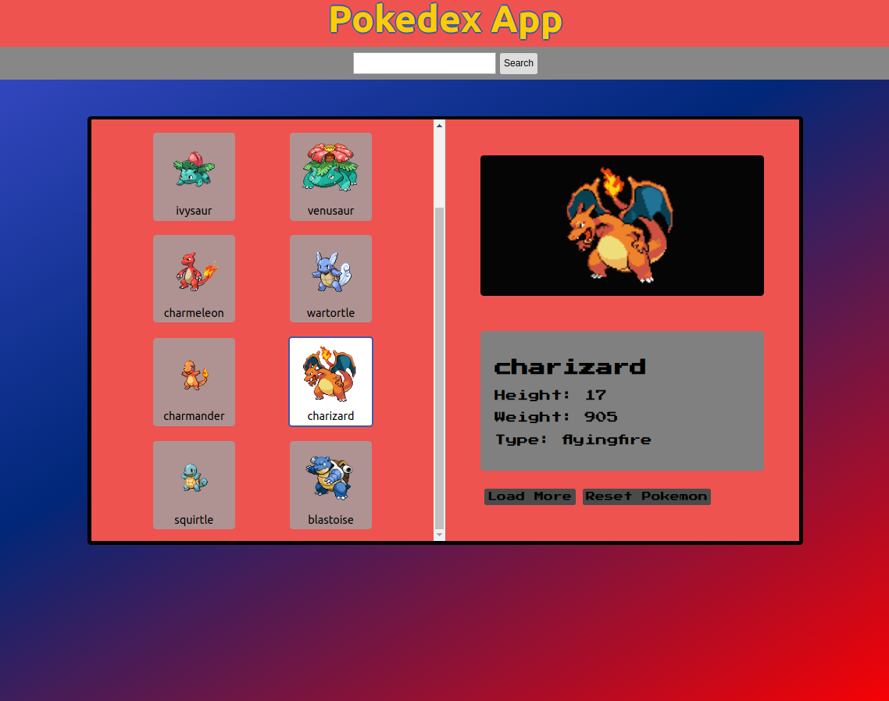
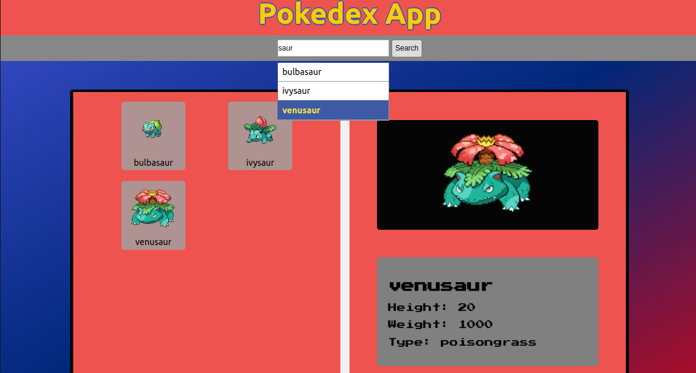

## Pokedex App

A react powered application that fetches from [PokeAPI](https://pokeapi.co/) to generate list of pokemon and view their attributes. Building this application taught me how to implement search suggestions and autocomplete.

inspired by: https://www.pokemon.com/us/pokedex/

## Features
* Searchbar that queries PokeAPI for matched pokemon
* Live search that implements autocompletion and suggestions
* Fetches Pokemon realtime from [PokeAPI](https://pokeapi.co/)
* Optimized for load performance by limiting API requests and caching data
* Button to load more data to reveal more Pokemon
* Reset search results and return to home

## To Be Implemented
* Filters by specific Pokemon attributes
* Sort by specific filter
* Error handling
* Local storage favorited Pokemons through caching
* Search by more fields other than name

## Building

* `npm start` - start development server
* `npm run build` - build into the `public/` directory

